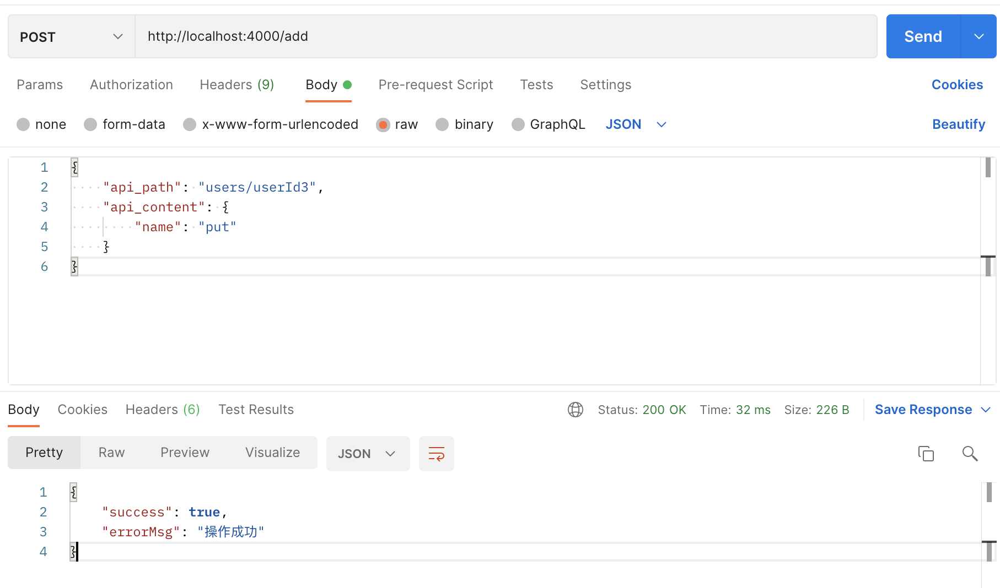
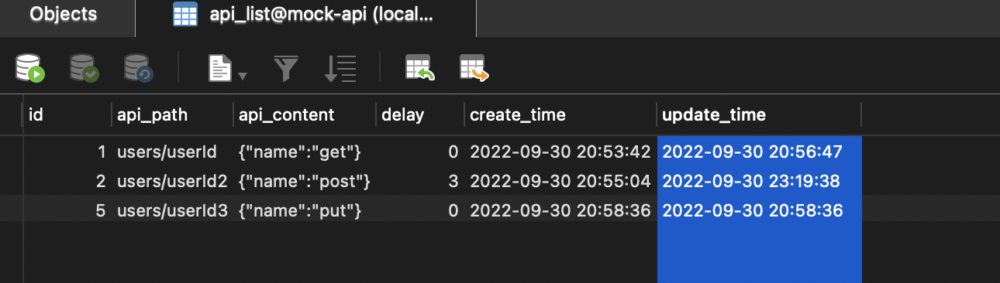

# koa-mock(v1版本)

### 使用

```
# 安装依赖
npm install

# 启动mock数据接口
npm run start
```

#### GET
```js
router.get("/users/userId", async (ctx) => {
  ctx.response.type = "json";
  ctx.response.body = {
    name: "get",
  };
});
```
#### POST
```js
router.post("/users/userId2", async (ctx) => {
  ctx.response.type = "json";
  // 请求体参数
  const resBody = ctx.request.body;
  console.log("resBody===>", resBody);
  ctx.response.body = {
    name: "post",
  };
});
```

#### PUT
```js
router.put("/users/userId3", async (ctx) => {
  ctx.response.type = "json";
  ctx.response.body = {
    name: "put",
  };
});
```

#### POST
```js
router.delete("/users/userId4", async (ctx) => {
  ctx.response.type = "json";
  ctx.response.body = {
    name: "delete",
  };
});
```


---


# koa-mock(v2版本)

### 使用
```
# 安装依赖
npm install

# 启动mock数据接口
npm run start:v2
```


### 通过 /add 接口 往api_list表添加数据



