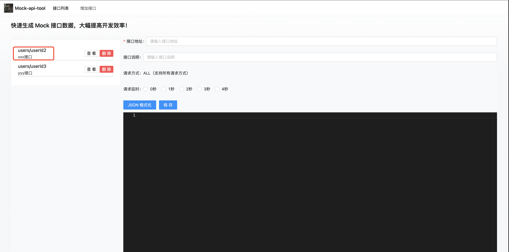
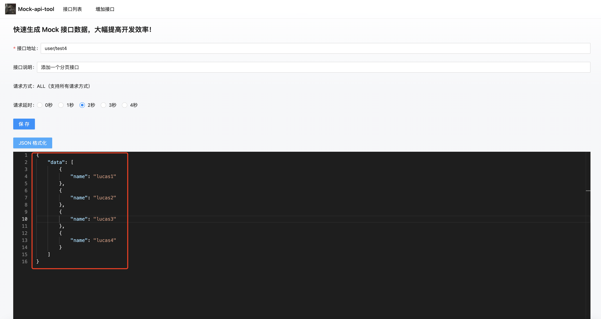

# mock-api-tool

## mock-api-tool服务端启动
### 使用
```
cd mock-api-tool-backend

# 在这里配置 MySQL 数据库
src/config/index.js

# 安装依赖
npm install

# 启动mock数据接口
npm run start
```

## mock-api-tool前端启动
### 使用
```
cd mock-api-tool-frontend

# 安装依赖
npm install

# 启动
npm run dev
```

## mock-api-tool前端界面操作
### 1、编辑接口

点击接口路径，选择该接口，然后进行编辑操作。

"查看"按钮：查看该mock接口返回的数据。

"删除"按钮：删除该mock接口。




### 2、增加接口


### 3、增加分页接口

data字段必须是一个数据。




### 4、请求分页接口

必须传递pageNum、pageSize才会返回分页数据。

